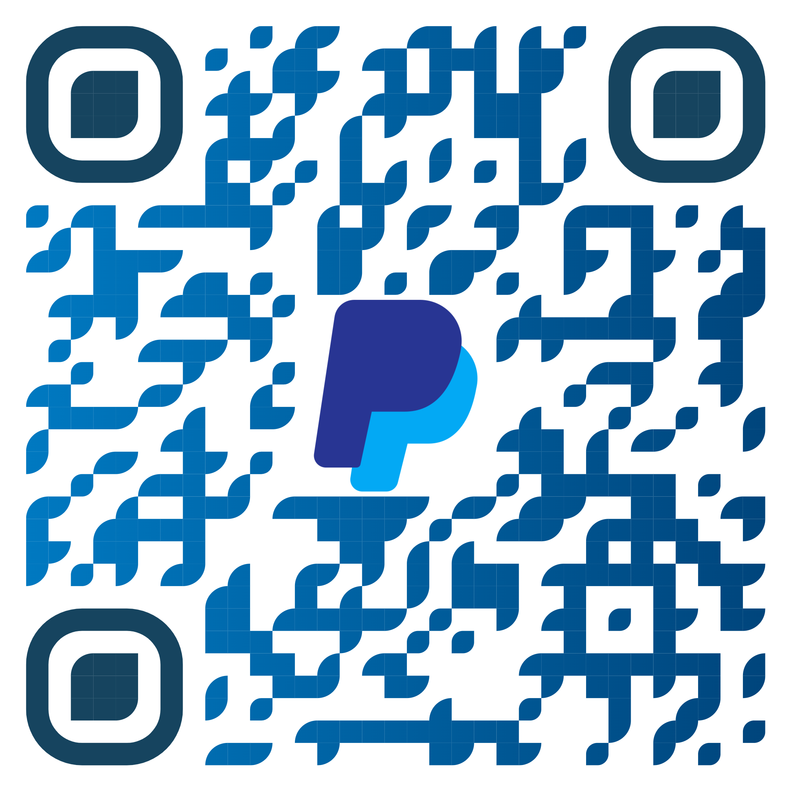

    
 "I have no special talent. I am only passionately curious". Albert Einstein
    

# Hi there 👋
- 🧑‍🎓 My name is Manuel and I'm a Computer Science student at the University of Parma
- 🐧 I'm interested in Linux and the concept of free-software. Take a look at my [Linux-rice](https://github.com/manueldiagostino/.dotfiles)!
- ⚙️ Founder&Maintainer of [unipr-org](https://github.com/unipr-org)
- 🧮 Probability formulary [here](https://manueldiagostino.github.io/files/formulario.pdf)

## 📊 GitHub Stats

    
    

    

## Contacts

<!--
## Buy me a coffee!

    
    </img>

-->

<!--
**manueldiagostino/manueldiagostino** is a ✨ _special_ ✨ repository because its `README.md` (this file) appears on your GitHub profile.

Here are some ideas to get you started:

- 🔭 I’m currently working on ...
- 🌱 I’m currently learning ...
- 👯 I’m looking to collaborate on ...
- 🤔 I’m looking for help with ...
- 💬 Ask me about ...
- 📫 How to reach me: ...
- 😄 Pronouns: ...
- ⚡ Fun fact: ...
-->
